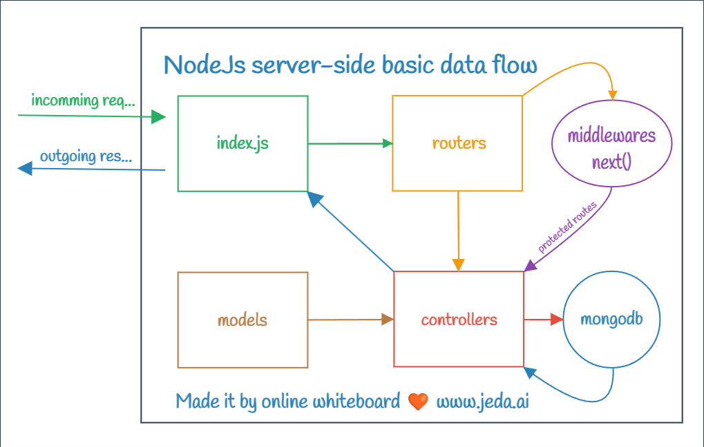

> 13 - Oct - 2024

# Chat App | MERN Stack


## Backend endpoints:-
| No| Context & File Link           | Method  | Api Endpoint               |
| --| ------------------------------| ------- | ---------------------------|
| 1 | [Registration][registration]  | ➡️ POST | /api/v1/auth/`register`    |
| 2 | [Login][userLogin]            | ➡️ POST | /api/v1/auth/`login`       |
| 3 | [Logout][userLogout]          | ➡️ POST | /api/v1/auth/`logout`      |
| 4 | [Get Users][getUsers]         | GET  ⬅️ | /api/v1/`users/`           |
| 5 | [Get Message][getSms]         | GET  ⬅️ | /api/v1/`messages/:id`     |
| 6 | [Send Message][sendSms]       | ➡️ POST | /api/v1/`messages/send/:id`|


[registration]: ./backend/src/modules/auth/controllers/registration.js
[userLogin]:    ./backend/src/modules/auth/controllers/login.js
[userLogout]:   ./backend/src/modules/auth/controllers/logout.js
[getUsers]:     ./backend/src/modules/user/controllers/getUsersForSidebar.js
[getSms]:       ./backend/src/modules/messages/controllers/getMessage.js
[sendSms]:      ./backend/src/modules/messages/controllers/sendMessage.js

```
    ├─── auth
    │    ├─── register
    │    ├─── login
    │    └─── logout
    │
    ├─── users
    │    └─── /
    │   
    └─── messages
        ├─── /:id
        └─── /send/:id
```

<br/>

## To run backend properly, setup the `.env` file

```jsx
# 🟢 To run this project... these following values will be required...

MONGODB_URI = *******

CLIENT_URL = *******

JWT_NAME = *******
JWT_SECRET = *******
JWT_EXPIRES_IN = *******
```

<br/>

## Backend run in local:-

```
cd backend
```
```
yarn dev
```

## Frontend run in local:-

```
cd frontend
```
```
yarn dev
```

<br/>

## NodeJs | Backend Basic Data Flow...

